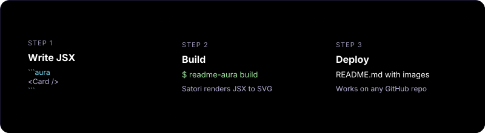

Write custom **React/JSX components** directly inside your Markdown, and readme-aura will render them into beautiful SVGs that work on GitHub.

GitHub strips all JS and CSS from README files. This tool lets you bypass that limitation by compiling your designs into static SVG images at build time.

## How It Works

1. Run `npx readme-aura init` in your repo — creates workflow, source template, and audits `.gitignore`
2. Edit `readme.source.md` — add JSX components inside ` ```aura ` code blocks
3. Preview locally with `npx readme-aura build` — JSX gets rendered to SVG via [Vercel Satori](https://github.com/vercel/satori)
4. Push to `main` — the GitHub Action auto-generates your `README.md`



## Quick Start

Run one command in your repo — it creates the GitHub Actions workflow, a starter `readme.source.md`, and ensures `.gitignore` won't block generated files:

```bash
npx readme-aura init
```

Then preview locally:

```bash
npx readme-aura build
```

That's it. Push to `main` and the workflow will auto-generate your `README.md` on every push.

> `init` auto-detects profile repos (`username/username`) and picks the right template.

### Commands

| Command | Description |
|---------|-------------|
| `npx readme-aura init` | Scaffold workflow, source template, audit `.gitignore` |
| `npx readme-aura build` | Render ` ```aura ` blocks to SVG and generate `README.md` |

### Build Options

| Option | Default | Description |
|--------|---------|-------------|
| `-s, --source` | `readme.source.md` | Source markdown file |
| `-o, --output` | `README.md` | Output markdown file |
| `-a, --assets` | `.github/assets` | Directory for generated SVGs |
| `-f, --fonts-dir` | — | Custom fonts directory |
| `-g, --github-user` | auto-detect | GitHub username for stats |
| `-t, --github-token` | `$GITHUB_TOKEN` | Token for GitHub API |

### Init Options

| Option | Default | Description |
|--------|---------|-------------|
| `--template` | auto-detect | Template: `profile` or `project` |
| `--force` | `false` | Overwrite existing files |

## What `init` Creates

The `init` command sets up everything you need:

**`.github/workflows/readme-aura.yml`** — GitHub Action that rebuilds your README on every push to `main` and on a daily schedule (to keep GitHub stats fresh):

```yaml
name: Generate README
on:
  push:
    branches: [main]
    paths: ['readme.source.md']
  schedule:
    - cron: '0 6 * * *'
  workflow_dispatch:

permissions:
  contents: write

jobs:
  generate:
    runs-on: ubuntu-latest
    steps:
      - uses: actions/checkout@v4

      - name: Generate README
        uses: collectioneur/readme-aura@main
        with:
          github_token: ${{ secrets.GITHUB_TOKEN }}
```

**`readme.source.md`** — Starter template with example ` ```aura ` blocks, customized for your repo type.

**`.gitignore` audit** — Ensures `.github/assets/`, `.github/workflows/`, `README.md`, and `readme.source.md` are not ignored.

## Features


* **Write React/JSX** — Use familiar `style={{ }}` syntax with flexbox, gradients, shadows
* **Powered by Satori** — Vercel's engine converts JSX to SVG without a browser
* **Custom Fonts** — Inter bundled by default, bring your own via `--fonts-dir`
* **Meta Syntax** — Control dimensions: ` ```aura width=800 height=400 `
* **GitHub-Compatible** — Output is pure Markdown + SVG, works everywhere

## Animations

You can add **CSS-based SVG animations** using the `<style>` injection mechanism. Satori renders a static frame at build time; the browser animates the SVG when it is displayed (e.g. on GitHub).

**How it works:** Add a `<style>` block in your JSX. Define `@keyframes` and apply them to elements by `#id` or `.class`. The renderer extracts and injects the CSS into the final SVG.

**Animatable properties:** `transform` (translate, scale, rotate), `opacity`, `fill`, and `stroke-dasharray`/`stroke-dashoffset`. Layout properties (`width`, `height`, `margin`) are unreliable.

**Targeting:** Use `id` on SVG elements (`<ellipse id="glow">`, `<g id="group">`) and reference them in CSS: `#glow { animation: pulse 2s infinite; }`. Raw SVG elements preserve `id`; Satori-rendered HTML may not always preserve `className`.


**Limitations:** No JavaScript, no SMIL. GitHub strips scripts but supports CSS animations. Prefer `transform` and `opacity` for best compatibility.

## Tech Stack


## If You Use readme-aura

* **Add the topic:** Consider adding the [readme-aura](https://github.com/topics/readme-aura) topic to your repository so others can discover it.
* **Keep the footer:** I would appreciate it if you keep the "powered by readme-aura" footer in your README. It helps others find and try the tool.

## License

MIT


<br>

<p align="center"><sub>𝗉𝗈𝗐𝖾𝗋𝖾𝖽 𝖻𝗒 <a href="https://github.com/collectioneur/readme-aura">𝗋𝖾𝖺𝖽𝗆𝖾-𝖺𝗎𝗋𝖺</a></sub></p>
