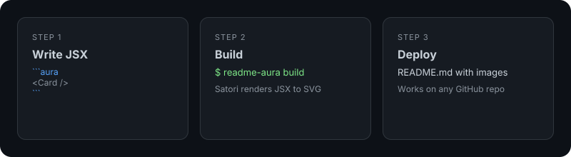

Write custom **React/JSX components** directly inside your Markdown, and readme-aura will render them into beautiful SVGs that work on GitHub.

GitHub strips all JS and CSS from README files. This tool lets you bypass that limitation by compiling your designs into static SVG images at build time.

## How It Works

1. Write a `readme.source.md` with standard Markdown
2. Add JSX components inside ` ```aura ` code blocks
3. Run the build (GitHub Action or `node dist/cli.js build`) — JSX gets rendered to SVG via [Vercel Satori](https://github.com/vercel/satori)
4. Get a clean `README.md` with embedded SVG images



## Quick Start

**Option 1 — GitHub Action (recommended)**\
Add the workflow below; it uses the [readme-aura action](https://github.com/collectioneur/readme-aura) from this repo (no npm install).

**Option 2 — Local build**\
Clone this repo, then from the repo root:

```bash
npm ci && npm run build && node dist/cli.js build
```

This reads `readme.source.md` from the current directory, renders all ` ```aura ` blocks to SVG, saves them to `.github/assets/`, and outputs a final `README.md`.

### CLI Options

| Option               | Default            | Description                  |
| -------------------- | ------------------ | ---------------------------- |
| `-s, --source`       | `readme.source.md` | Source markdown file         |
| `-o, --output`       | `README.md`        | Output markdown file         |
| `-a, --assets`       | `.github/assets`   | Directory for generated SVGs |
| `-f, --fonts-dir`    | —                  | Custom fonts directory       |
| `-g, --github-user`  | auto-detect        | GitHub username for stats    |
| `-t, --github-token` | `$GITHUB_TOKEN`    | Token for GitHub API         |

## GitHub Actions (Auto-Rebuild)

Add this workflow to your repo and your README will regenerate automatically on every push and on a daily schedule (to keep GitHub stats fresh).

**1. Create** `readme.source.md` in your repo root with ` ```aura ` blocks.

**2. Add** `.github/workflows/readme-aura.yml`:

```yaml
name: Generate README
on:
  push:
    branches: [main]
    paths: ["readme.source.md"]
  schedule:
    - cron: "0 6 * * *"
  workflow_dispatch:

permissions:
  contents: write

jobs:
  generate:
    runs-on: ubuntu-latest
    steps:
      - uses: actions/checkout@v4

      - name: Generate README
        uses: collectioneur/readme-aura@main
        with:
          github_token: ${{ secrets.GITHUB_TOKEN }}
```

**3. Push to `main`** — the action runs, generates SVGs, and commits the final `README.md`.

> Works for both profile repos (`username/username`) and regular repos.

## Features


- **Write React/JSX** — Use familiar `style={{ }}` syntax with flexbox, gradients, shadows
- **Powered by Satori** — Vercel's engine converts JSX to SVG without a browser
- **Custom Fonts** — Inter bundled by default, bring your own via `--fonts-dir`
- **Meta Syntax** — Control dimensions: ` ```aura width=800 height=400 `
- **GitHub-Compatible** — Output is pure Markdown + SVG, works everywhere

## Tech Stack


## License

MIT

<br>

<p align="center"><sub>𝔭𝔬𝔴𝔢𝔯𝔢𝔡 𝔟𝔶 <a href="https://github.com/collectioneur/readme-aura">𝔯𝔢𝔞𝔡𝔪𝔢-𝔞𝔲𝔯𝔞</a></sub></p>
