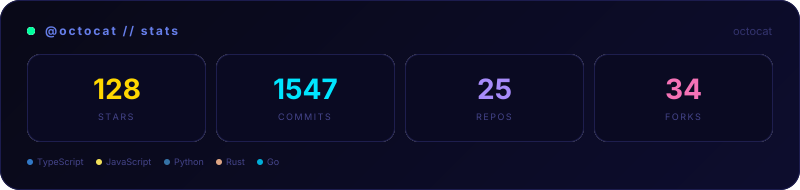

# GitHub Profile Example

This example demonstrates how to use `github.*` data in aura blocks.
Run with: `npx readme-aura build -s examples/github-profile.source.md -o examples/github-profile.md --github-user YOUR_USERNAME`

## Profile Card

## Stats Overview

