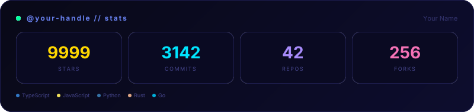
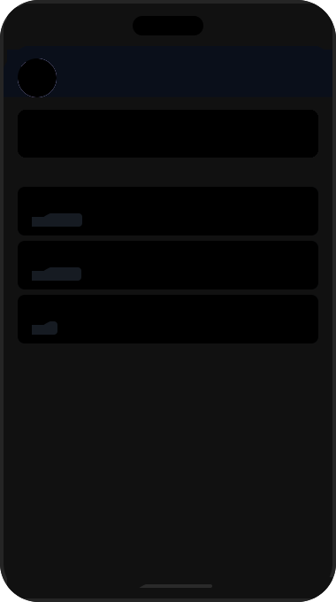
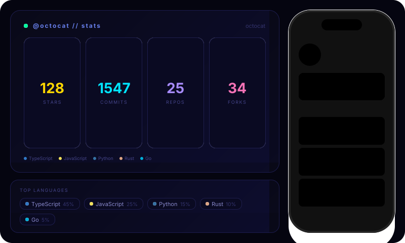
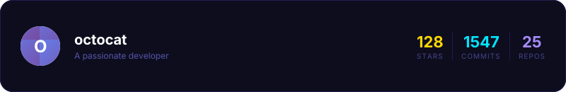

# Wow Components — readme-aura Built-in Library

`StatsCard` and `MockupPhone` ship with readme-aura and are available in every `aura` block
without any imports. Just use them like `<StatsCard github={github} />`.

***

## Hero Banner


***

## `<StatsCard />`

Cyberpunk/neon stats card — stars, commits, repos, forks as glowing tiles with a language strip.
Syntax: ` ```aura width=800 height=190 ` then `<StatsCard github={github} />` then ` ``` `.


You can spread-override specific values for static/preview use:



***

## `<MockupPhone />`

Phone-frame mockup — avatar initial, mini stats bar, and top repositories inside a phone shell.
Syntax: ` ```aura width=380 height=680 ` then `<MockupPhone github={github} />` then ` ``` `.



***

## Combined Dashboard

Both components composed inside a single `aura` block — phone frame on the right, stats and
language grid on the left, all unified on one dark canvas.



***

## Custom Composition (Raw JSX)

Full creative control — no components required. This is a hand-written profile card using only
raw Satori-compatible JSX with gradients, glows, and live GitHub data.


